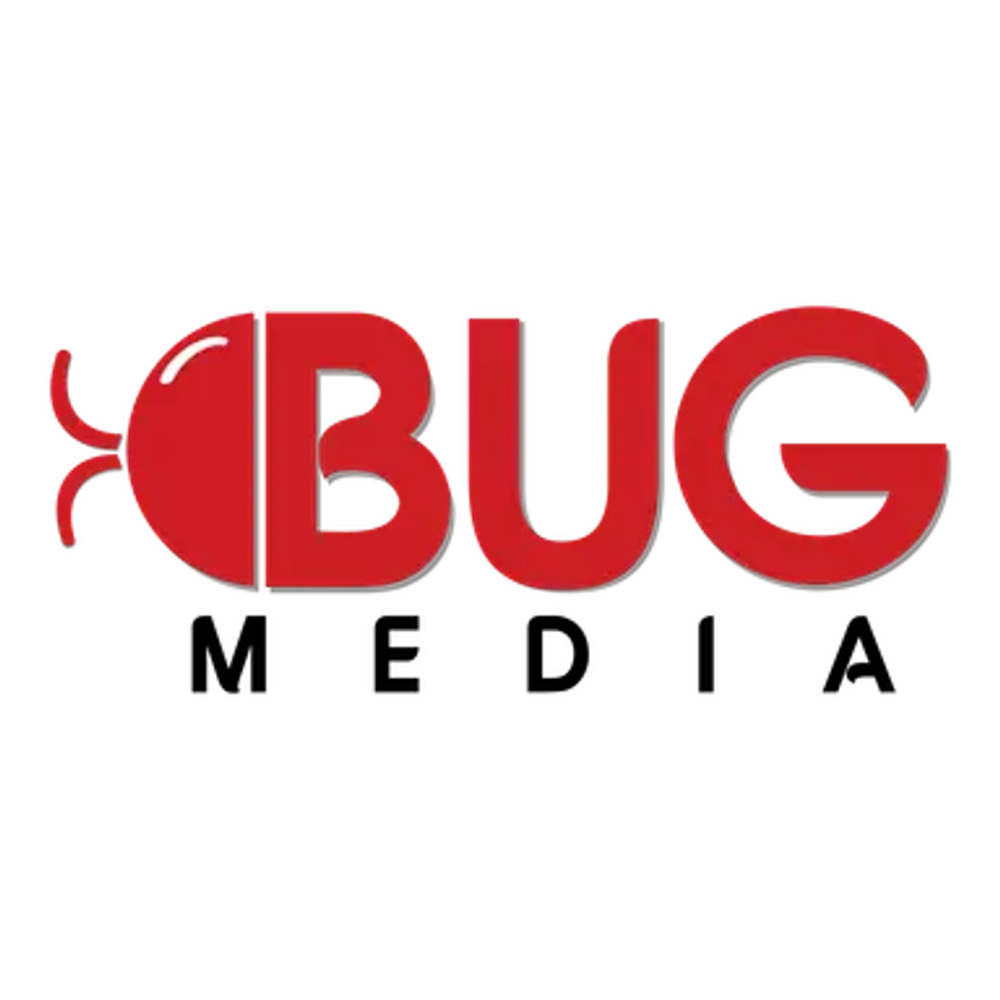

<div align="center">
  
  <h1>BugLogin</h1>
  <strong>A powerful anti-detect browser that puts you in control of your browsing experience.</strong>
</div>
<br>

<p align="center">
  <a style="text-decoration: none;" href="https://github.com/xuanhong04/bug-login-release/releases/latest" target="_blank">
  </a>
  <a style="text-decoration: none;" href="https://github.com/xuanhong04/bug-login-release/issues" target="_blank">
    
  </a>
  <a style="text-decoration: none;" href="https://github.com/xuanhong04/bug-login-release/blob/main/LICENSE" target="_blank">
    
  </a>
  <a href="https://app.codacy.com/gh/buglogin/buglogin/dashboard?utm_source=gh&utm_medium=referral&utm_content=&utm_campaign=Badge_grade">
    
  </a>
  <a href="https://app.fossa.com/projects/git%2Bgithub.com%2Fbuglogin%2Fbuglogin?ref=badge_shield&issueType=security" alt="FOSSA Status">
    
  </a>
  <a style="text-decoration: none;" href="https://github.com/xuanhong04/bug-login-release/stargazers" target="_blank">
    
  </a>
</p>

## Features

- Create unlimited number of local browser profiles completely isolated from each other
- Safely use multiple accounts on one device by using anti-detect browser profiles, powered by [Camoufox](https://camoufox.com)
- Proxy support with basic auth for all browsers
- Import profiles from your existing browsers
- Automatic updates for browsers
- Set BugLogin as your default browser to control in which profile to open links

## Download

> For Linux, .deb and .rpm packages are available as well as standalone .AppImage files.

The app can be downloaded from the [releases page](https://github.com/xuanhong04/bug-login-release/releases/latest).

<details>
<summary>Troubleshooting AppImage on Linux</summary>

If the AppImage segfaults on launch, install **libfuse2** (`sudo apt install libfuse2` / `yay -S libfuse2` / `sudo dnf install fuse-libs`), or bypass FUSE entirely:

```bash
APPIMAGE_EXTRACT_AND_RUN=1 ./BugLogin_x.x.x_amd64.AppImage
```

If that gives an EGL display error, try adding `WEBKIT_DISABLE_DMABUF_RENDERER=1` or `GDK_BACKEND=x11` to the command above. If issues persist, the **.deb** / **.rpm** packages are a more reliable alternative.

</details>

<!-- ## Supported Platforms

- ✅ **macOS** (Apple Silicon)
- ✅ **Linux** (x64)
- ✅ **Windows** (x64) -->

## Development

### Contributing

See [CONTRIBUTING.md](CONTRIBUTING.md).

### Runtime Rule (Windows vs WSL)

- Do not share the same `node_modules` across Windows PowerShell and WSL/Linux.
- Install dependencies and run Tauri commands in the same runtime.
- `pnpm dev`, `pnpm tauri ...`, `pnpm format`, `pnpm lint`, and `pnpm test` are guarded by `scripts/guard-node-modules-runtime.mjs` and stop when runtime artifacts are mixed.
- If you get a guard error, reinstall dependencies in your current runtime:
  - Windows: `Remove-Item -Recurse -Force node_modules && pnpm config set shell-emulator true && pnpm install`
  - WSL/Linux: `rm -rf node_modules && pnpm install`

### Agent Workflow Rule

- Full verification is conditional. Run `pnpm format && pnpm lint && pnpm test` for high-risk changes, pre-merge/release, or when explicitly requested.
- During active `pnpm tauri dev` sessions, defer heavy lint/test unless explicitly requested to avoid long recompiles or interruptions.
- Non-trivial workflow changes should be tracked via `openspec/` and `docs/workflow/beads/`.
- Superpowers usage guide: `docs/workflow/superpowers/README.md`.
- Workflow hub (single entrypoint): `docs/workflow/README.md`.

## Issues

If you face any problems while using the application, please [open an issue](https://github.com/xuanhong04/bug-login-release/issues).

## Self-Hosting Sync

BugLogin supports syncing profiles, proxies, and groups across devices via a self-hosted sync server. See the [Self-Hosting Guide](docs/self-hosting-buglogin-sync.md) for Docker-based setup instructions.

## Community

Have questions or want to contribute? The team would love to hear from you!

- **Issues**: [GitHub Issues](https://github.com/xuanhong04/bug-login-release/issues)
- **Discussions**: [GitHub Discussions](https://github.com/xuanhong04/bug-login-release/discussions)

## Star History

<a href="https://www.star-history.com/#buglogin/buglogin&Date">
 <picture>
   <source media="(prefers-color-scheme: dark)" srcset="https://api.star-history.com/svg?repos=buglogin/buglogin&type=Date&theme=dark" />
   <source media="(prefers-color-scheme: light)" srcset="https://api.star-history.com/svg?repos=buglogin/buglogin&type=Date" />
   
 </picture>
</a>

## Contributors

<!-- readme: collaborators,contributors -start -->
<table>
	<tbody>
		<tr>
            <td align="center">
                <a href="https://github.com/XuanHongitHub">
                    
                    <br />
                    <sub><b>XuanHong</b></sub>
                </a>
            </td>
            <td align="center">
                <a href="https://github.com/keyduc91">
                    
                    <br />
                    <sub><b>keyduc91</b></sub>
                </a>
            </td>
            <td align="center">
                <a href="https://github.com/zhom">
                    
                    <br />
                    <sub><b>zhom</b></sub>
                </a>
            </td>
            <td align="center">
                <a href="https://github.com/HassiyYT">
                    
                    <br />
                    <sub><b>Hassiy</b></sub>
                </a>
            </td>
            <td align="center">
                <a href="https://github.com/JorySeverijnse">
                    
                    <br />
                    <sub><b>Jory Severijnse</b></sub>
                </a>
            </td>
		</tr>
	<tbody>
</table>
<!-- readme: collaborators,contributors -end -->

## Contact

Have an urgent question or want to report a security vulnerability? Send an email to `security@buglogin.local` and the team will get back to you as fast as possible.

## License

This project is licensed under the AGPL-3.0 License - see the [LICENSE](LICENSE) file for details.
